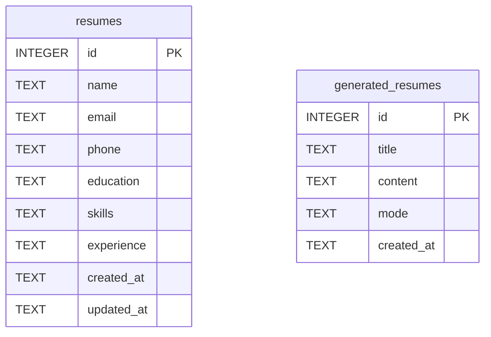

# ER Diagram

## AI Resume Generator Pro - Entity Relationship Diagram

---

## Visual ER Diagram

```
┌─────────────────────────────────┐
│         resumes                 │
├─────────────────────────────────┤
│ PK  id           INTEGER        │
│     name         TEXT (NOT NULL)│
│     email        TEXT           │
│     phone        TEXT           │
│     education    TEXT           │
│     skills       TEXT           │
│     experience   TEXT           │
│     created_at   TEXT           │
│     updated_at   TEXT           │
└─────────────────────────────────┘
             
             (No Relationship)
             
┌─────────────────────────────────┐
│    generated_resumes            │
├─────────────────────────────────┤
│ PK  id           INTEGER        │
│     title        TEXT (NOT NULL)│
│     content      TEXT (NOT NULL)│
│     mode         TEXT           │
│     created_at   TEXT           │
└─────────────────────────────────┘
```

---

## Mermaid ER Diagram



---

## Legend

- **PK** = Primary Key
- **NOT NULL** = Required field
- **No relationships** = Tables are independent

---

## Notes

- Database: SQLite3
- File: resumes.db
- Tables: 2 (resumes, generated_resumes)
- No foreign keys between tables

